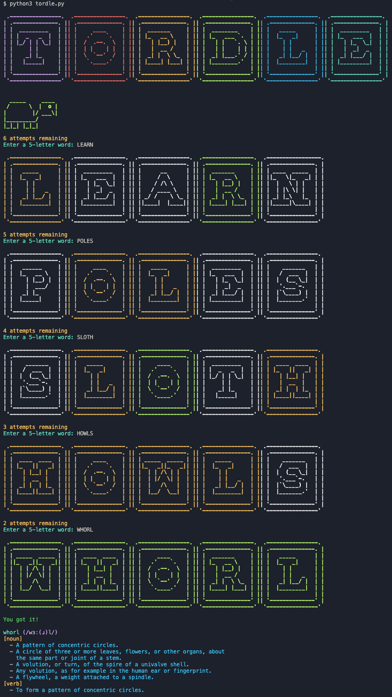

# Tordle - Terminal Wordle

*Tordle* is the terminal version of popular game [Wordle](https://www.nytimes.com/games/wordle/index.html).

## Demo



## Installation

Clone this repository:

```bash
git clone https://github.com/alvii147/Tordle.git
```

Create and activate Python virtual environment (optional):

```bash
python3 -m venv env
# Linux/MacOS
source env/bin/activate
# Windows
source env/Scripts/activate
```

Install dependencies:

```bash
pip3 install -r requirements
```

Run *Tordle*:

```bash
python3 tordle.py
```
